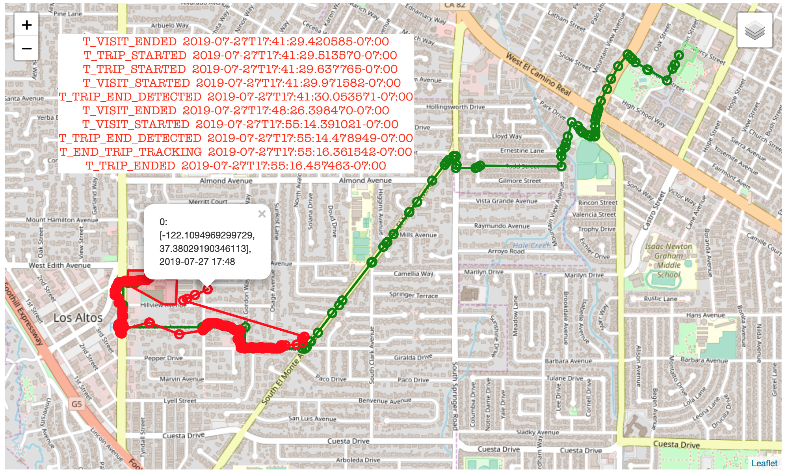

Evaluation parameters
---------------------

The experiment evaluates the power, accuracy and analysis trade-offs along 3 timelines of varying lengths. It first establishes the relationship between power and the *sensed accuracy* of the raw data received from the phone. The raw data consists of location, trip transitions and motion activity detection (Section [sec:virtualsensorsanalysis]). Android does not expose a trip end sensor, so the evaluation uses includes a custom dwell based implementation. Finally, it explores the improvements to overall accuracy by analysis algorithms.

### Built-in, black-box sensing parameters

Modern smartphones include closed source APIs for

1.  *fused location sensing*, which determines location with the specified accuracy based on a combination of GPS, Wi-Fi and other sensors,

2.  *trip start/end detection*, which uses low power sensing to detect when a trip starts or ends, and

3.  *motion activity detection*, which uses low-power sensors to determine whether the traveler is walking, bicycling or in a car.

Since the APIs are black-boxes to HMS builders, we evaluate the accuracy at various sensing settings. Configurations are a combination of these settings, so `HAMFDC` stands for High Accuracy, Medium Frequency, Duty Cycled collection.

High accuracy vs. Medium (HA vs. MA)  
High accuracy will tend to favor GPS and result in high power consumption.

High frequency vs. Medium (HF vs. MF)  
High frequency will sense and process more often so is likely to have higher spatiotemporal accuracy (e.g., will hug corners) but with higher power consumption.

Duty cycling vs. Always on (DC vs. AO)  
Duty cycling allows for high accuracy, high frequency sensing with low power drain, but with sensing gaps at trip start due to delay in detecting the trip start.

### Trip end detection during sensing

Note that there is currently no built-in, app-invokable trip end detection API for android. We implement a naïve trip end detection algorithm to fill this gap for the sensing evaluation. For each sensed point, the algorithm reads the data from the last 5 minutes, computes the distances from the current point, and checks to see if the max distance is below the trip end detection threshold. This allows us to control for noise in the data and avoid spurious trip end detection. The computation cost for this algorithm depends on the density of the collected points since we run the algorithm more frequently and check more points on each run. More efficient algorithms that run less frequently or check fewer points will have lower computational needs but less sensitivity. Our results show that Google appears to have implemented a duty cycling algorithm for android that is more efficient than our naïve algorithm. This is consistent with our reasons for using virtual sensors where possible (Section [sec:virtualvscustom]). If this algorithm were exposed for third party apps to listen to, we could use virtual sensors for all our sensing needs.

Metrics
-------

The post-processing steps can be classified into three broad themes, each of which can be evaluated using multiple metrics (Section [sec:classicalgorithms]).

Segmentation  
Splits a stream of sensed values into meaningful *segments* — e.g., *trips* and *sections*.

Trajectory tracking  
Detects outliers in spatiotemporal trajectories caused by erroneous sensing and removes them.

Classification  
Assigns labels to the segments. The most common classification task, and the only one we will evaluate here, is the determination of the travel mode for every section.

We now outline the common error conditions for each algorithm type, and define the metrics that can be used to characterize the error. Additional concrete examples of error characteristics can be found in the interactive notebooks of the evaluation repository[1]

### Segmentation

![**Examples of errors in segmentation captured by the segmentation metrics**. *Top: large error in the trip start time for an iOS `HAHFDC` run*. The green line is the ground truth, red line is the sensed data. We got a visit end (trip start) transition at 18:41, but we detected a trip end within 30 ms so we did not sense any data. The next trip start was at 17:48, when we did start reading values, but this was almost the end of the trip.*Bottom: error in segmentation trip count for an android `HAMFDC` run*. On one multi-modal trip, we get multiple trip start and end transitions, largely corresponding to transit transfers. Note also that there at 8:30, there are two consecutive geofence exits (08:30 and 09:15) and an erroneous point in San Jose.](figs/segmentation_count.png) [fig:segmentationerrorexamples]

The main error conditions for segmentation algorithms are:

1.  the algorithm detects the correct number of segments, but the start and end transitions don’t match the ground truth (Figure [fig:segmentationerrorexamples], top)

2.  the algorithm detects more segments than the ground truth, flip-flopping during a single real segment (Figure [fig:segmentationerrorexamples], bottom)

3.  the algorithm detects fewer segments than the ground truth

**Matching algorithm for evaluation** In order to evaluate these metrics, we need to come up with an algorithm that can find the matching segments for a given ground truth segment. This is an evaluation algorithm that will be used to evaluate the performance of more complex post-processing algorithms. In order to avoid infinite recursion, it should be simple and deterministic and not involve exhaustive evaluation of its own.

Our proposed matching algorithm has two steps.

1.  The first step, which is only applicable while evaluating raw sensor data, converts a sequence of *transitions* (e.g., `VISIT_ENDED, VISIT_STARTED`) into candidate *ranges* by matching start and end transitions. This is not applicable while evaluating post-processed data, since the output of the post-processing step will already generate segments.

    Input  
    Set of transitions (S|E)\* with some potentially missing or duplicated

    Output  
    Pairs of (S, E) transitions that define the sensed ranges

    Implementation  
    For each S, find the first corresponding E. Any intermediate unexpected transitions are ignored — e.g., `{S_0, S_1, E_0, E_1,
    E_2, E_3} -> {S_0, E_0}`

2.  The second step, which is always applicable, matches the ground truth trip or section segment with an arbitrary number of sensed ranges from the previous step.

    Input  
    `GTS = {gt_1, gt_2, ...}, SS = {ss_1, ss_2,...}, forall ss, ss = (S, E)`

    Output  
    `SS_g \subseteq SS \forall g \in GTS\)`

    Implementation  
    For each `g` find the _ss_s_ with the closest start timestamp and the `ss_e` with the closest end timestamp. Both matches have threshold of `T_c` beyond which we will not match any entry. Then, `SS_g = {ss_s, ... ss_e}`. Note that we match each ground truth segment in isolation, so it is possible for a particular `ss` to match two separate `g`. However, because of the threshold on the match, we expect this to be unlikely.

### Trajectory tracking

![**Examples of errors in trajectory captured by the trajectory tracking metrics**. *Top: Spatial tracking errors from multiple iOS `MAHFDC` runs.* The green line is the ground truth, other colors are the sensed data. For each sensed trajectory, the spatial error is the shortest perpendicular distance to the spatial ground truth line (i.e., the thick blue line from the brown point to the green line. *Bottom: Temporal errors caused by backtracking to previous spatially valid point, based on an android `HAMFDC` run*. The sensed points in red are largely along the spatial ground truth trajectory in green, but they periodically return to a previous point in the trajectory, generating zigzags. In this case, the spatial error of the repeated points is small, but the temporal error, encompassing cross-bay jumps, is large.](figs/temporal_tracking_errors.png) [fig:trajectorytrackingerrors]

The main error conditions for tracking algorithms are:

1.  the sensed points are spatially offset from the real trajectory (Figure [fig:trajectorytrackingerrors], top). The metric for this error condition is fairly straightforward, since we know the spatial ground truth for each evaluation timeline. We can simply compute the error for each sensed point as the shortest distance from the point to the ground truth trajectory. Note that since we compute the error for each sensed point, this metric does not capture large gaps in the sensed data - e.g., the delay in sensing at the start of every trip. Those errors are captured by the segmentation metrics.

2.  the sensed points have temporal inconsistencies (Figure [fig:trajectorytrackingerrors], bottom). It is much harder to determine a metric for this error condition since we do not have spatiotemporal ground truth for trajectories. Computing the spatial distance alone will not capture the error, since the error was caused by repeatedly returning to an earlier point. For this metric, we generate a spatiotemporal reference trajectory for each run based on the accuracy control phones and use it for the comparison. Note that we must construct a reference trajectory *for each run*, since temporal factors (e.g., congestion, transit delays) are likely to be different even for different runs of the same timeline.

Formally, let the set of sensed points for an evaluation run \(r\) be \(P_r\). Let the set of corresponding spatial ground truth points be \(G\). Note that the spatial ground truth is not dependent on the run. Let the accuracy control points for android and iOS respectively be \(ACP_{a_{r}}\) and \(ACP_{i_{r}}\). Let the temporal start and end ground truth for the segment being evaluated be \(TGT
= \{tgt_s, tgt_e\}\). We can then define the metrics as follows:

  
Perpendicular distances from the sensed points to the ground truth trajectory. Lower is better. `[\sqrt{\frac{1}{|P|}\sum_{p \in P_r} d(p, G)^2}]`

  
1.  Use the accuracy control and ground truth trajectories to determine a combined spatiotemporal reference trajectory `G_r`. Reference trajectory calculation is complicated because the accuracy controls have significant error in practice. Note that, unlike spatial ground truth, spatiotemporal ground truth is **run-specific**, due to variations in travel time.

2.  Perpendicular distance from the sensed points to the reference trajectory. `[\sqrt{\frac{1}{|P|}\sum_{p \in P_r} d(p, G_r)^2}]`

### Classification

Classification metrics are the easiest to work with, since they fit well into classical machine learning paradigms. Since each section has a mode, and we know the ground truth modes, we can simply count the number of correct values to represent the accuracy. However, there are some challenges that are unique to this domain.

1.  The list of modes supported by the classifier may be limited. In particular, it may not be easy to distinguish between city and express buses, or between regular bicycles and e-bikes. Therefore, classification algorithms may choose to restrict the set of classes that they support, mapping all bus trips to `BUS` and all bicycling trips to `BICYCLING`.

2.  Since we classify sections, the classification accuracy depends on the segmentation accuracy. For example, if a classification algorithm uses the average speed as a determining factor, but the segmentation combines the walk to the station with the subsequent short train section, the section may be misclassified. We address this by reporting the ratio of the sensed segment that has the correct mode.

Formally, let `GTS` be the set of ground truth segments for a particular timeline. As with the segmentation metrics, each `gts \in GTS` can match a sequence `SS_{gts} = {ss_gts_1}, ss_gts_2},...,ss_gts_n}}` of `ss
\in SS`. Note that since we only label modes, we only consider *sections* and not generic *segments* here. Similar metrics can be applied to trip labels (e.g., purpose) if we support them in the future. We can then define the overall, segmentation-dependent accuracy by checking the fraction of time spent in matching modes. Note that this can sometimes be greater than 1, as a spillover from segmentation mismatches (Table [fig:segmentationgt1]). As close to 1 as possible is better. `a_s = \sum_{ss_gts \in SS_gts, ss_gts.label = gts.label} \frac{|ss_gts.end_ts - ss_gts.start_ts|}{|gts.end_ts - gts.start_ts|} \forall gts \in GTS`

|idx|automotive|confidence|cycling|running|stationary|walking|fmt_time|
|---|----------|----------|-------|-------|----------|-------|--------|
|154|False|medium|False|False|False|**True**|19:01:53-07:00|
|155|False|high|False|False|False|False|19:02:46-07:00|
|156|False|medium|False|False|False|**True**|19:02:51-07:00|
|157|False|high|False|False|False|**True**|19:03:46-07:00|
|||||…||||
|172|False|medium|False|False|False|**True**|19:17:59-07:00|
|173|False|high|False|False|False|**True**|19:18:15-07:00|
|174|False|high|False|False|False|False|19:19:06-07:00|
|175|False|medium|False|False|False|**True**|19:19:34-07:00|
|176|False|high|False|False|False|False|19:19:41-07:00|
|177|False|medium|False|False|False|**True**|19:19:49-07:00|
|178|False|high|False|False|False|**True**|19:20:04-07:00|
|179|False|high|False|False|False|False|19:21:16-07:00|
|180|False|high|False|False|False|**True**|19:21:36-07:00|
|181|False|high|False|False|False|False|19:22:36-07:00|
|182|False|high|False|False|True|False|19:27:21-07:00|
|183|False|high|False|False|False|False|19:28:01-07:00|

[fig:segmentationgt1]

Once we have computed these metrics, we can combine them in various ways for comparisons. For example:

1. we can combine the data for a timeline (e.g., `unimodal trip car bike mtv la`)
1. we can combine the data for a mode (e.g., `CAR`)
1. we can combine the data for a trip or section (e.g., `freeway driving weekday`)
