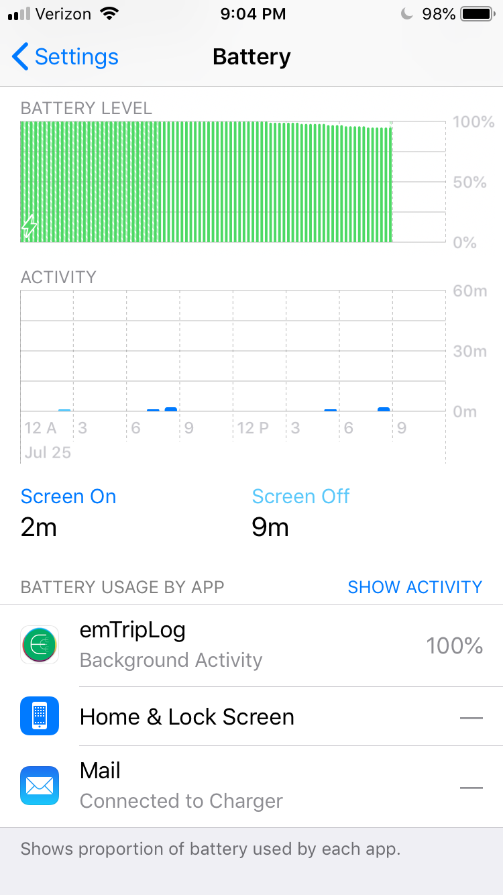
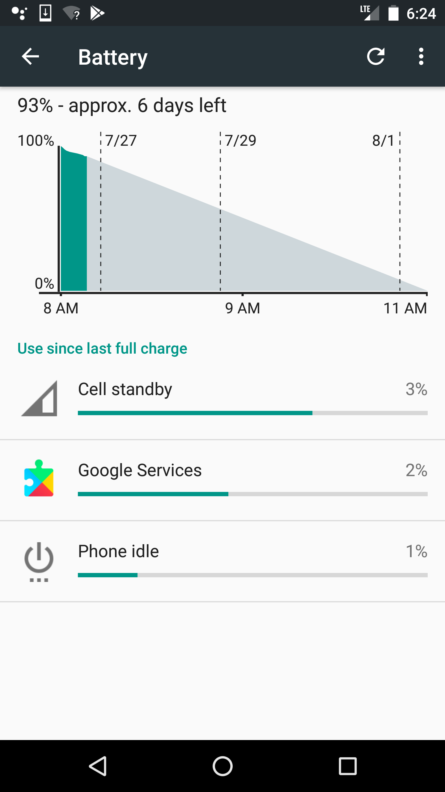

Discussion of alternative procedures
====================================

While em-eval (Section [sec:our-procedure]) addresses the complexities of HMS evaluation, it also imposes a much higher researcher burden than the ad hoc method. This raises the question of whether all these controls are necessary or merely sufficient. In this section, we discuss some alternative approaches and highlight the unexpected behavior that they would miss. This list is not comprehensive but provides a flavor of the arguments without tedious repetition.

|:-:|
||
||

[fig:poweraccuracyvariations]

No artificial trips
-------------------

Creating predetermined trips requires an upfront investment in effort, and requires the data collector to take trips just for data collection. An alternative would use multiple phones, but allow data collectors to go about their regular routines and tag the modes only. We could use the accuracy control phones to determine the ground truth trajectory.

No privacy  
Capturing the data collector’s regular routines compromises their privacy. Even if the data does not include their name or phone number, a list of their commonly visited places and trips can form a unique fingerprint that can uniquely identify them . This sensitivity precludes evaluation data from being published and used for reproducible research.

No repetition  
The behavior of the same phone with the same configuration can vary over time, both for power and for accuracy (Figure [fig:poweraccuracyvariations]). Repeating the same trip multiple times allows us to detect and remove outliers. With ad hoc trips, it is unclear whether any difference in behavior is real or caused by context-sensitive variation. And without predetermined trips, it is challenging to repeat the same trips and trajectories over time.

No spatial ground truth  
No sensor is perfect and even the accuracy control phones can have sensing errors. If we see a divergence between an experiment phone and the accuracy control, it is unclear which one has the error (Figure [fig:poweraccuracyvariations]).

cc  & 

[fig:powermeasurementchallenges]

No control
----------

Using control phones requires the researcher to purchase multiple phones of the same make, model and approximate age. While used smartphones are relatively cheap (USD 50 – USD 100), 4 android phones and 4 iPhones combined will still cost USD 400 – USD 800. An alternative would be to use one phone each for each OS, perform the timeline trips, and look at the app-specific power consumption reported by the phone OS.

Sensor access attribution and the meaning of the %  
Sensor access in modern phone OSes (android and iOS) is also context-sensitive, making it unclear how it is counted for per-app consumption. For example, if multiple apps request a sensor reading, the OS delays returning a result until it can batch related requests and serve all of them with a single sensor access (e.g., Figure [fig:smoothingnavigationstartexample]). This is why the OSes treat the sensing frequency as a hint instead of a guarantee. Second, if sensor access is mediated by a service (e.g., fused location in Google Play Services), it is unclear whether the sensor access is counted for the service or the app (Figure [fig:powermeasurementchallenges]). And finally, although android reports per app consumption as a % of the battery *capacity*, iOS does so as a % of the battery *consumption*. This indicates that on dedicated phones, the HMS under test will always show close to 100%, whether it is the power control or the accuracy control (Figure [fig:powermeasurementchallenges]). Using a control phone for the power will cancel out these context-sensitive effects and estimate the difference in power drain with and without the HMS app component installed.

Custom duty cycling increases power drain  
Sensing is not the only source of power consumption — CPU usage can also have a significant impact on power usage. HMSes can use smart local processing to reduce local sensing, but the increased power consumption from the CPU can cancel out the savings from the sensing. Including an accuracy control showed that, unlike in 2015 (Section [sec:apioverview]), the basic duty cycling algorithm in our experiment paid for itself in low frequency sensing but actually increased power usage for high frequency sensing (Figure [fig:powermeasurementchallenges]).

