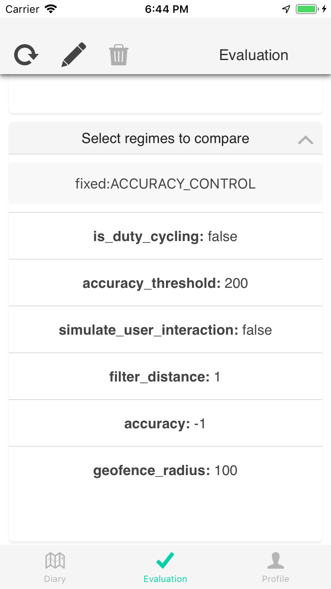

Evaluation system design
========================

The em-eval procedure (Section [sec:our-procedure]) allows us to estimate the power/accuracy trade-off of various sensing configurations used in Human Mobility Systems (HMSes). One of the novel components of the procedure involves the specification of pre-defined, artificial trips with ground-truthed trajectories and modes.

This section explores the nuances of implementing such a procedure. We first describe a publicly available reference implementation of a system – em-eval-zephyr – that can be used perform this procedure. We then discuss challenges encountered while using the system to perform an experiment in the San Francisco Bay Area (Section [sec:accuracyevaluation]). Some of these challenges were addressed by system improvements, while others are documented as best practices for future data collectors.

ccc  &  & 

[fig:em-eval-zephyr-ui]

System overview
---------------

em-eval is a generic *procedure* for HMS evaluation – it does not actually collect any data. To use it, we need a concrete system that configures data collection based on the spec configurations, collects coarse temporal ground truth, periodically reads battery levels and stores data for future analysis.

We built a system – em-eval-zephyr – that combines our prior work on power evaluations  with our existing HMS platform  and supports performing the em-eval procedure. The system consists of three main parts:

Evaluation Specification  
The *spec* describes an evaluation that has been performed or will be performed in the future. In addition to mode and trajectory ground truth, it includes the app configurations to be compared and the mapping from phones to evaluation *roles*. The spec automatically configures both the data collection app and the standard analysis modules.

To reduce evaluator burden, we provide preprocessing functions to fill in trajectory information based on route waypoints for road trips and OSM relations for public transit. We also provide sample notebooks to verify timelines and their components before finalizing and uploading the evaluation spec.

Auto-configured Smartphone App  
We have generated a custom UI skin for our e-mission platform  that is focused on evaluation. It allows evaluators to select the current spec from the public datastore, and automatically downloads the potential comparisons to be evaluated, the role mappings and the timeline.

Since the e-mission platform data collection settings are configurable through the UI, the sensing configurations defined in the spec are automatically applied based on the phone role when the data collector starts an experiment. For example, when starting an experiment to compare high accuracy (HAHFDC) versus medium accuracy (MAHFDC) data collection, the second experiment phone will automatically be set to MAHFDC settings. Finally, when the data collector performs the trips, he marks the transition ground truth in the UI, and the app automatically displays the next step in the timeline (Figure [fig:em-eval-zephyr-ui]).

Public Data + Sample Access Modules  
Since there are no privacy constraints, em-eval-zephyr uploads all collected data to a public instance of the e-mission server. The associated repository contains sample notebooks that can download, visualize and evaluate the data associated with a particular spec. All the data used in this paper is publicly available, and the notebooks can be manipulated interactively using binder[1].

Note that although the em-eval **procedure** is general, the current implementation of the em-eval-zephyr **system** is integrated only with the e-mission platform. Using the procedure with other HMSes will require re-implementing the em-eval procedure with the other HMS, or using a combination of systems for the evaluation. For example, em-eval-zephyr can still read the battery level periodically, display the trip sequence to the data collector, and be used to mark the transition ground truths. However, the evaluator needs to configure the settings for the app being tested manually, and to download, clean and analyze the resulting data.

System iterations and lessons learned
-------------------------------------

As we started collecting data, we had to resolve some ambiguities around exactly when the transition ground truth should be collected. We also discovered best practices that increased the likelihood of successful data collection. This section outlines these lessons learned.

System change: capture transition complexity  
One of the big promises of using HMSes for instrumenting human travel is that we don’t have to focus only on the primary mode. Instead, with fine-grained data collection, we can understand the full complexity of end to end travel.

In fact, the only true unimodal trips are walking trips. Everything else is multi-modal. Thus, a significant change to the system was to restore the hidden complexity that is elided from user descriptions of travel diaries. For example, consider the trip description “Drive from Mountain View Library to Los Altos Library”. Although that appears to be a unimodal trip, it is actually a multi-modal trip which involves implicit walk access sections to and from the car at the source and destination respectively.

It is not possible to predetermine the ground truth for these walk access sections since we cannot control which parking spaces are available when we perform the trip. We address such issues by adding *shim sections*, and expanding the start and end from points to \(\approx\) 100 m polygons. We can then relax the constraints around ground truth within the polygon by only using the reference dataset, but still check the accuracy of the mode inference (Figure [fig:em-eval-zephyr-ui]).

Best practice: Pilots are critical  
In spite of reviewing the predetermined trajectories ahead of time as part of the validation process, and also having them displayed on the em-eval-zephyr UI, we found that we frequently made small mistakes, during the first round of data collection for a new timeline. Sometimes, we found that the predefined routes, potentially suggested by Open Source Routing Machine (OSRM), felt unsafe to bicycle on. We had to tweak the specification to pick safer routes. The second repetition generally resolved these issues. In order to avoid a stressful data collection experience, we suggest running through a new timeline with a trial run before starting full-featured data collection.

Best practice: Mindfulness  
Remembering to mark the transition ground truths was one of the hardest parts of the ongoing data collection and really highlights the challenges of ground truth collection. In spite of the fact that she was performing artifical trips to collect data for her own project, one of the authors forgot to mark wait \(\rightarrow\) move transitions during the pilot for the long multi-modal timeline because she had started checking her email while waiting. It is important to be present in the moment and pay attention to the context while collecting data.

[1] <https://mybinder.org/>
