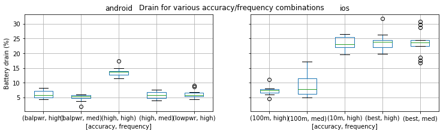
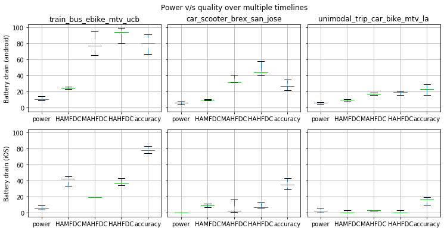

Evaluation
==========

|:-:|
||
||
||

Experiment design
-----------------

em-eval is a generic evaluation procedure and can be used with any kind of HMS. em-eval-zephyr is a reference implementation of em-eval that used to evaluate many experimental settings relevant to HMSes over any set of trajectories. The evaluator can pick her settings based on her research goals. In this section, we outline our goals for this evaluation, and use them to define three timelines that cover 15 separate modes, including recently popular modes such as escooter and ebike.

Dwell time  
Instead of focusing only on trips, we wanted to evaluate a timeline that included significant dwell time. We could see from our calibration runs that android appears to have built-in duty cycling and including significant dwell time would allow us to capture the impact of this context sensitive behavior. Therefore, we structured our timeline trips as round trips to libraries with an intermediate dwell time \(\approx 3 \times\) the mean travel time to the location.

Broad range of modes  
HMS evaluations should cover a broad spectrum of trip types, and since we are creating artificial trips, we can structure them to maximize mode variety. In order to efficiently cover this space, we tried to ensure that no mode was repeated. We only had to include commuter rail twice since there were few other transit options to reach the starting point chosen.

Multi-modal transfers  
Detecting multi-modal transfers in a HMS is tricky because there isn’t a clear signal similar to a trip end. We ensure that there are many transition examples by emphasizing multi-modal transfers.

With those goals in mind, we decided on three artificial timelines of varying lengths that cover a total of 15 separate modes. We chose each timeline to be round trips to libraries so as to not include identifiable location data (e.g., home location) in our experiments. A description of each timeline with the associated modes and dwell times is given in Table  [table:timelines-table].

Since this paper focuses on the evaluation procedure, to avoid bias, we do not use it to evaluate any particular HMS. Instead, we use it to evaluate the virtual sensors provided by smartphones themselves. These virtual sensors are exposed by smartphone operating systems (OSes) by combining underlying physical sensors using proprietary algorithms. iOS already restricts developer access to the GPS, instead supporting a virtual location sensor that chooses underlying sources based on developer-supplied accuracy constants. As phone OSes impose greater background restrictions on apps, we can only expect the use of such sensors to grow. In this section, we analyze spatial accuracy and motion activity accuracy from our collected data, and draw inferences from them to demonstrate the benefits that can be gained by using a procedure such as em-eval.

X|X|X|X|X|X id & Description & Outgoing trip modes & Incoming trip modes & Dwell time & Overall time
 & & car & bike & 1 & 3
& & (city streets) & & hrs & hrs
& & & & &
 & & car & escooter & 3 & 5.5
& & (freeway) & Bus Rapid Transit & hrs & hrs
 & & commuter train & ebike (shared) & 6 & 12.5
& & subway & express bus & hrs & hrs
& & city bus & downtown walk & &
& & & light rail & &
& & & commuter rail & &

[table:timelines-table]

Spatial accuracy
----------------

Box plots of the distribution of spatial error of the measured locations against the groundtruth in the different timelines are shown on the top row of Figure  [fig:spatio-temporal-plot]. It is interesting to note the skewed nature of the plots, and the presence of different outliers, whose values seem to vary across phones across timelines. Ad-hoc evaluation schemes would probably identify them by comparing error values against a threshold. Choosing this threshold without the knowledge of the distribution of error values would be difficult and introduce ambiguity to the evaluation. Our statistical and systematic approach eliminates these difficulties.

Motion activity accuracy
------------------------

The distribution of temporal error between the ground truth section transitions and sensed activity transitions is shown in the bottom row of Figure  [fig:spatio-temporal-plot]. The plot shows that despite the presence of outliers, the quality of sensing does not seem to impact any difference in accuracy. Thus, a study focusing on places and modes but not trajectories could choose a lower quality sensing configuration and reduce power drain.

|:-:|
||
||
||
||

[fig:spatio-temporal-plot]
